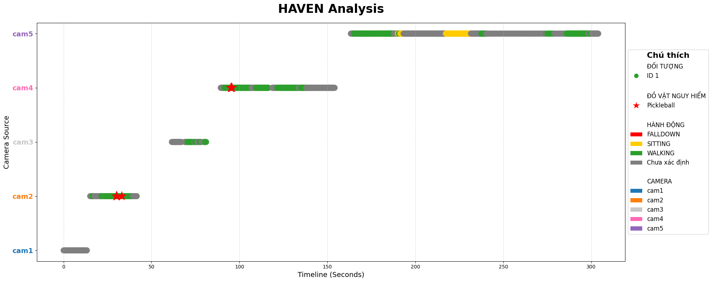

# HAVEN: Home Activity Vision & Event Network

Hệ thống giám sát thông minh hỗ trợ nhận diện hành vi ADL (Activity of Daily Living), phát hiện sự cố và cảnh báo an ninh bằng AI.

### Demo Hoạt Động


### Bảng Phân Tích Dữ Liệu


---

## Tính Năng Chính

1.  **Nhận diện tư thế (Pose Detection)**: Phân loại các trạng thái cơ thể như Đứng, Đi, Ngồi, Nằm.
2.  **Phát hiện sự kiện (Event Detection)**: Nhận biết các hành động như Ngã, Ngồi xuống, Đứng lên.
3.  **Giám sát khu vực (Zone Intrusion)**: Cảnh báo khi có người xâm nhập vào các vùng đã thiết lập.
4.  **Phát hiện vật thể (Object Detection)**: Nhận diện các vật dụng nguy hiểm trong khung hình như Dao, Kéo, Điện thoại.
5.  **Định danh người (ReID)**: Theo dõi và duy trì ID của từng người qua nhiều camera khác nhau.
6.  **Cảnh báo xâm nhập (Intruder Alert)**: Phát hiện người lạ tại khu vực cấm (Cam4) với cảnh báo nhấp nháy đỏ.

---

## THUẬT TOÁN HỆ THỐNG HAVEN (HIERARCHICAL SECURITY)

### 1. LOGIC PHÂN CẤP CAMERA
- **Cam1 (Cổng chính - Master)**: 
  - Đăng ký Face ID (yêu cầu rõ mặt) -> Cấp Global ID.
  - Từ chối nếu chất lượng kém.
- **Cam2, Cam3 (Giám sát - Slave)**: 
  - Chỉ xác thực (Match) với ID đã có.
  - Không tìm thấy -> Báo UNKNOWN (Đỏ).
- **Cam4 (Khu vực cấm - Strict)**: 
  - Xác thực ID như trên.
  - Phát hiện người lạ (UNKNOWN) -> BÁO ĐỘNG INTRUDER (Viền đỏ nhấp nháy).

### 2. CÔNG NGHỆ THÀNH PHẦN
- **Tracking**: ByteTrack + Kalman Filter (Theo dõi đối tượng).
- **Pose Estimation**: YOLOv11-Pose (17 điểm khớp xương).
- **ADL (Hành vi)**: Hình học (Geometry rules) phân loại Ngã, Ngồi, Đứng.
- **ReID (Định danh)**: Color Histogram + Spatial Constraint (Ngưỡng chẵn 0.85).
- **Object Detection**: YOLOv11 (Phát hiện Dao, Gậy, Vũ khí).

---

## Công Nghệ Sử Dụng

| Thành phần | Công nghệ |
|------------|-----------|
| AI Core | Ultralytics YOLOv11 (Pose & Object Detection) |
| Tracking | ByteTrack (Multi-Object Tracking) |
| Xử lý hình ảnh | OpenCV, NumPy |
| Phân tích dữ liệu | Pandas, Matplotlib, Seaborn |
| Backend & Database | Python, SQLite |
| Video Processing | FFmpeg, OpenCV VideoWriter |

---

## Hướng Dẫn Sử Dụng

### Chạy nguồn video
Sử dụng để kiểm thử với file video có sẵn.
```bash
.\sequential.bat
```

### Phím Tắt
| Phím | Chức năng |
|------|-----------|
| Q | Thoát chương trình |
| Space | Tạm dừng / Tiếp tục |
| N | Chuyển sang camera tiếp theo |
| G | Ghi hình MP4 (lưu vào output.mp4) |

---

## Cấu Trúc Thư Mục

```
D:/HAVEN/
├── backend/
│   ├── data/multi-camera/     # Videos đầu vào (cam1/, cam2/, cam3/, cam4/)
│   ├── database/              # SQLite database
│   ├── models/                # YOLO models
│   ├── multi/                 # Core runner code
│   └── outputs/               # Output videos, logs, screenshots
├── configs/                   # Configuration files
├── output.mp4                 # Video recording output
├── sequential.bat             # Main runner script
└── README.md                  # Documentation
```

---

## Output

- **CSV Log:** `D:\HAVEN\backend\outputs\log.csv`
- **Database:** `D:\HAVEN\backend\database\haven_reid.db`
- **Video:** `D:\HAVEN\output.mp4` (khi nhấn G để ghi hình)
